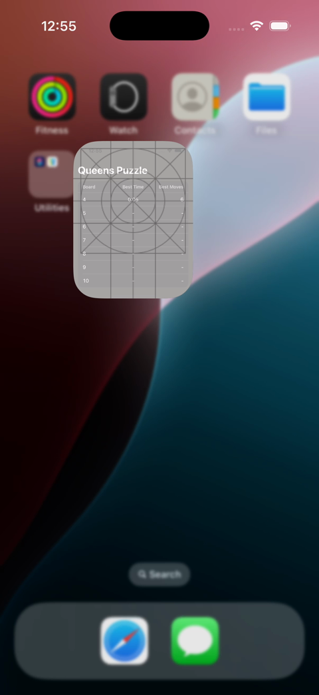

# Queens Puzzle

An iOS SwiftUI implementation of the N-Queens puzzle. Pick a board size (4–10), tap to place queens, and try to fill the board so that no two queens attack each other.

## Demo

<p align="center">
  <video src="docs/preview.mp4" controls muted playsinline width="320" poster="docs/preview-poster.png">
    <a href="docs/preview.mp4"></a>
  </video>
</p>

> If the inline player doesn't load, [watch the demo here](docs/preview.mp4).

## Build

The Xcode project lives in `QueensPuzzle/`. Open and build from there:

```bash
cd QueensPuzzle
xcodebuild -project QueensPuzzle.xcodeproj -scheme QueensPuzzle \
  -destination 'platform=iOS Simulator,name=iPhone 17 Pro' build
```

Or open `QueensPuzzle.xcworkspace` in Xcode 26+ and build with `⌘B`.

Requirements: Xcode 26.4+, iOS 26.4 simulator or device. No third-party dependencies.

## Run

In Xcode, select the `QueensPuzzle` scheme and a simulator (iPhone 17 Pro and iPad Pro 13" M5 are the canonical targets), then `⌘R`.

## Test

The project has two test targets:

- `QueensPuzzleTests` — Swift Testing (`@Test`, `#expect`). Covers the rules engine, reducer, store, and UI snapshots.
- `QueensPuzzleUITests` — XCTest + `XCUIApplication` for the end-to-end golden path.

Run everything from the command line:

```bash
cd QueensPuzzle
xcodebuild -project QueensPuzzle.xcodeproj -scheme QueensPuzzle \
  -destination 'platform=iOS Simulator,name=iPhone 17 Pro' test
```

Or `⌘U` in Xcode.

> **IMPORTANT — snapshot tests are simulator-pinned**
>
> The `QueensUI` snapshot suite is recorded against **iPhone 17 Pro on iOS 24.6 in Light Mode**. Snapshot images are pixel-exact and depend on the simulator's screen size, scale, font metrics, and rendering pipeline, so running them on any other device, iOS version, or in Dark Mode will produce false-positive diffs.
>
> Before running the suite locally:
>
> - Use the `iPhone 17 Pro` simulator on **iOS 24.6** specifically — not the latest available runtime.
> - Set the simulator appearance to **Light** (Features → Toggle Appearance, or `xcrun simctl ui booted appearance light`).
>
> If you need to re-record snapshots, do it on this same configuration and commit the updated reference images.

---

## Architecture

The app is split into two local Swift packages plus the App target. Dependencies flow strictly one way: **App → QueensUI → QueensCore**.

```
QueensPuzzle/
├── Packages/
│   ├── QueensCore/   # Pure domain + logic. No SwiftUI.
│   └── QueensUI/     # SwiftUI views. Depends only on QueensCore.
└── QueensPuzzle/     # App target. Composition root, services, navigation.
```

`ARCHITECTURE.md` is the source of truth for the decisions below — this section is the high-level tour.

### 1. Game logic is fully independent from the view layer

`QueensCore` knows nothing about SwiftUI. To keep that boundary lean but expressive, the core is built around a **reducer**:

```swift
func reduce(_ state: inout GameState, _ action: GameAction)
```

All mutations funnel through this single pure function. Views call `store.send(.tap(position))`; they never write to state directly.

**Why a reducer:**

- It captures the game state as a single, explicit value — no scattered mutability.
- Every state transition is an `Action`, so the legal vocabulary of the game (tap, reset, new game, tick, won) is visible at a glance and easy to extend.
- Adding a new interaction means one new case and one new branch — both with focused tests.
- `GameState` is `Equatable` and trivially serializable, so save-game, share-state, or basic multiplayer become natural extensions rather than rewrites.

**Trade-off:**

- The reducer is shaped specifically for the N-Queens problem. Generalising to other constraint-satisfaction puzzles (N-rooks, bishops, knights) would mean revisiting `Rules` and introducing a `Problem` abstraction layer over CSPs. That's a deliberate non-goal for v1 — paying for it up front would be premature.

### 2. The UI

`QueensUI` is **pure SwiftUI** and knows nothing about navigation or game logic. It is, however, deliberately purpose-built for the N-Queens problem — it is not a generic chess UI kit.

Every exported view is a function of `data in → callbacks out`. Views take values (state, theme, closures) and emit intent. They never reference services, repositories, or the navigation stack, which means they render in Xcode Previews with no app-level setup and stay fully decoupled from the App's composition.

The UI is **fully compatible with iPad** as well as iPhone, and supports both portrait and landscape orientations. Layouts adapt to the available space rather than assuming a fixed phone-sized canvas.

### 3. The App

The App target is where composition happens — it wires `QueensUI` to the game logic in `QueensCore`.

- **`GameStore`** is the driver. It receives intents from the UI, runs them through the reducer, and publishes the new state back to the views. SwiftUI's diffing means only the affected leaves re-render on each transition, so even larger boards stay smooth.
- **Device-specific effects** (haptics, sound, timer, persistence) live here, behind protocols defined in `QueensCore`. The reducer itself stays pure.
- **Sound** uses `AudioServicesPlaySystemSound` rather than `AVAudioPlayer`. This API is purpose-built for short system-style cues (placing a piece, tapping a cell), it's cheap, and it doesn't require constructing and managing a player just to fire a quick effect. The one trade-off worth calling out: system sounds follow the **ringer** volume, not the media volume. That's actually desirable here — you don't want move-piece sounds blasting at music volume — but it's a deliberate choice, not an oversight.

### 4. Accessibility

Full VoiceOver support, with each cell announced using **algebraic chess notation** (`a1`, `b3`, etc.). It keeps the experience close to how chess players actually talk about a board, and gives non-sighted users a precise, familiar coordinate system instead of generic "row 3, column 5" labels.

### 5. Compromises

A few deliberate trade-offs given the scope of the exercise:

- **Conflict detection** is a straightforward O(k²) pair check. With k ≤ 10 queens there are at most 100 comparisons, so a smarter row/column/diagonal index wasn't worth the extra code.
- **Board size is capped at 10.** Beyond that, tap targets on iPhone become uncomfortably small. Raising the ceiling is a one-line change in `BoardSize.maximum`, but it would also need touch-ergonomic work (zoom, draggable cursor) to be usable.
- **Dynamic Type support is partial.** At the largest accessibility sizes, depending on orientation, some HUD elements can clip. A production version would either reflow the HUD or scope which elements scale.

---

## Testing strategy

Each layer of the architecture gets a different kind of test. The split mirrors the dependency direction (Core → UI → App), so each layer is exercised with the cheapest tool that can give a meaningful signal.

### QueensCore — pure unit tests (Swift Testing)

`QueensCore` has no UIKit/SwiftUI dependency, so the whole suite is plain `swift test`-runnable Swift Testing code. No simulator, no host app, fastest feedback loop in the project.

- **`RulesTests`** — the rules engine is the part that's easiest to get subtly wrong, so it gets the most coverage. Known-valid N-queens solutions for `n = 4, 5, 6, 8` act as positive fixtures, and crafted boards exercise each conflict axis (same row, same column, `\` diagonal, `/` diagonal). Negative `isSolved` cases cover empty boards, too-few queens, too-many queens, and right-count-but-with-a-conflict. `attackedSquares` is checked for a single queen's row/column/both diagonals and that queen squares themselves are never marked attacked.
- **`ReducerTests`** — one test per `GameAction` case (`.tap`, `.tick`, `.reset`, `.newGame`) plus no-op behaviour on a won board, plus assertions that the derived caches (`conflicts`, `attackedSquares`) are recomputed on every mutation. This is the contract the rest of the app depends on, so it's exhaustive on purpose.
- **`GameTransitionTests`** — `GameTransition` is the value the store uses to decide which side effects to fire (place sound vs. remove sound vs. win). Each derived field (`queenPlaced`, `queenRemoved`, `conflictsChanged`, `didWin`) has its own positive and negative cases, including the easy-to-miss ones like *conflicts cleared is not a "change"* and *won → won is not a "win"*.
- **`BoardSizeTests` / `PositionTests`** — small value-type tests. `BoardSize` covers the `4...10` bounds. `Position.algebraic(boardSize:)` is checked at every corner across multiple board sizes — this matters because the same string is used for VoiceOver labels and as accessibility identifiers in UI tests.

### QueensUI — snapshot tests

`QueensUI` views are pure functions of state — they take values and emit closures. That makes them ideal for snapshot testing: deterministic output, no async settling, no service stubs needed. The suite uses [pointfreeco/swift-snapshot-testing](https://github.com/pointfreeco/swift-snapshot-testing).

- **One snapshot suite per exported view**: `BoardView`, `CellView`, `GameHUDView`, `GameView`, `HomeView`, `ScoreRow`, `WinOverlayView`, plus `ButtonStyles`. Each view is rendered against the states it can actually be in (fresh, mid-game with conflicts, won, won-with-new-best, etc.) so a regression in any branch shows up as a pixel diff.
- **State fixtures are centralised** in `GameStateFixtures.swift`, so tests stay declarative — `GameView(state: .midGameWithConflicts())` rather than rebuilding boards inline.
- **Device matrix is fixed and explicit**: iPhone 17 Pro portrait + landscape and iPad Pro 13" portrait, all on iOS 26.4, defined in `SnapshotDevices.swift`. Snapshots are simulator-specific, so pinning the configs (size, safe area, trait collection) avoids false-positive diffs when the recorder runs on a different sim. This same matrix is what catches iPad and landscape regressions for free — if the layout breaks on one, the diff makes it obvious.

### App target — integration + end-to-end UI tests

The App target is where the layers compose, so its tests check that the wiring works rather than re-testing logic that's already covered below.

- **`GameStoreTests`** (Swift Testing, `@MainActor`) — integration tests for `GameStore` against fake services. The reducer is already proven pure in `QueensCore`; what these tests prove is that the store fires the right side effects in the right order:
  - `SpyHapticsService` and `SpySoundService` record every event, so we can assert sequences like `[.placeQueen, .conflict]` after a tap that creates a conflict, or `[.placeQueen, .win]` on the move that solves the board.
  - `InMemoryBestScoresRepository` (with optional seeded prior bests) verifies that wins persist scores and that `isNewBestTime` / `isNewBestMoves` are computed against the *prior* values, not the new ones.
  - `FakeClock` exposes a manual `tick(_ dt:)` and an `activeSubscribers` count, which lets the timer tests assert both that ticks advance `elapsed` and that `stopTimer()` actually cancels the subscription — without waiting on real time.
- **`QueensPuzzleUITests`** (XCTest + `XCUIApplication`) — end-to-end golden path against a real simulator build:
  - The app launches with `-uitesting-in-memory-scores`, swapping the persistent best-scores repository for an in-memory one. This keeps UI runs hermetic — no leaked state between runs, and "new best time" assertions are deterministic on a fresh launch.
  - The solve-a-4x4 test taps cells by their algebraic-notation accessibility identifiers (`b4`, `d3`, `a2`, `c1`). Reusing chess notation as the identifier means UI tests and VoiceOver labels stay in sync — if one breaks, both do.
  - Beyond the win itself, the test asserts the win overlay copy ("You won!", "New best time and move count!"), the presence of `Retry` and `Leave` buttons, and that `Leave` returns the user to the home screen. That's the smallest path that touches every layer (UI → store → reducer → rules → repository → back to UI), which is exactly what an E2E test should do.
